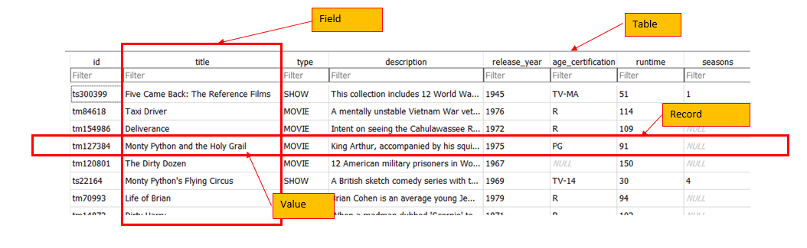
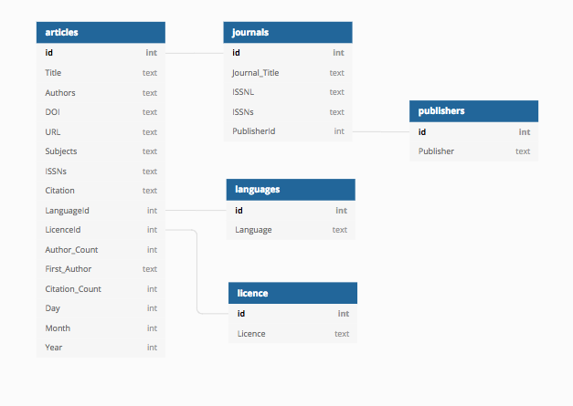
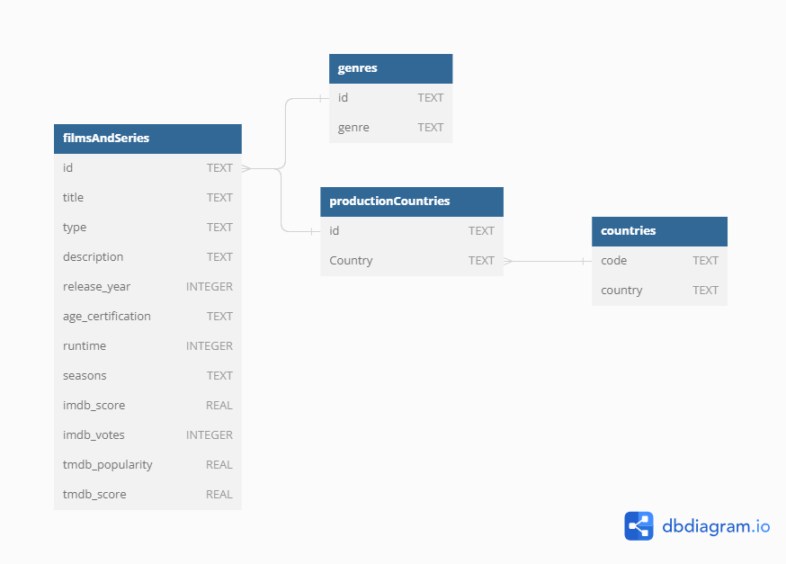

## Spreadsheets

Spreadsheets are often created to keep lists of a variety of things like an inventory of equipment or statistics. Spreadsheets are an easy way to display data organized in columns and rows. Column headers describe the data contained in corresponding columns. Each row is a record (sometimes called an observation) with data about it contained in separate column cells.

Spreadsheets can make data gathering easier but they can also lead to messy data. Over time, if you gather enough data in spreadsheets, you will likely end up with inconsistent data.

Designing a relational database for your data can help reduce the places where these errors can be introduced. You can also use SQL queries to find these issues and address them across your entire dataset. Before you can take advantage of all of these tools, you need to design your database.

## Database Design

Database design involves a model or plan developed to determine how the data is stored, organized and manipulated. The design addresses what data will be stored, how they will be classified, and the interrelationships between the data across different tables in the database.

## Terminology

{width = 800}
{width = 800}
{width = 800}
{width = 800}

{width = 800}

In the [Introduction to SQL](01-introduction.md) lesson, we introduced the terms "fields", "records", and "values". These terms are commonly used in databases while the "columns", "rows", and "cells" terms are more common in spreadsheets. Fields store a single kind of information (text, integers, etc.) related to one topic (title, year, etc.), while records are a set of fields containing specific values related to one item in your database (a movie, a country, etc.).

To design a database, we must first decide what kinds of things we want to represent as tables. A table is the physical manifestation of a kind of "entity". An entity is the conceptual representation of the thing we want to store informtation about in the database, with each row containing information about one entity. An entity has "attributes" that describe it, represented as fields. For example, a movie or a series is an entity. Attributes would be things like the title, or scores which would appear as fields.

To create relationships between tables later on, it is important to designate one column as a primary key. A primary key, often designated as PK, is one attribute of an entity that distinguishes it from the other entities (or records) in your table. The primary key must be unique for each row for this to work. 
A common way to create a primary key in a table is to make an 'id' field that contains an auto-generated integer that increases by 1 for each new record. This will ensure that your primary key is unique.

It is useful to describe on an abstract level the entities we would like to capture, along with how the different entities are related to each other. We do this using and entity relationship diagram (ER diagram or ERD).

## Entity Relationship Diagram (ER Diagram or ERD)

ERDs are helpful tools for visualising and structuring your data more efficiently. They allow you to map relationships between concepts and ultimately construct a relational database. The following is an ERD of the database used in this lesson:

Relationships between entities and their attributes are represented by lines linking them together. For example, the line linking filmsAndSeries and genres is interpreted as follows: The 'filmsAndSeries' entity is related to the 'genres' entity through the attributes 'id' in both tables.

Conceptually, we know that a movie or series can have several genres and each genre will have many many series and movies. This is known as a many-to-many relationship. 

## More Terminology

The degree of relationship between entities is known as their 'cardinality'. Using the filmsAndSeries - genres example, the 'filmsAndSeries' table contains a primary key (PK) called 'id'. When the PK is used to create a connection between the original table and a different table, it is called a foreign key (FK) in the other table. To follow the example, we see a field in the 'genres' table called id that contains the values from the 'id' field in the 'filmsAndSeries' table, connected the two tables.

There are 4 main types of relationships between tables:

- One to One - each item in the first table has exactly one match in the second table.
- One to Many - each item in the first table is related to many items in the second table, sometimes represented as 1 to \* or 1 to  ∞
- Many to One - many items in the first table is related to one item in the second table.
- Many to Many - many items in the first table are related to many items in the second table.

In our example of the 'id' field in the 'genres'  or 'productionCountries' tables has many to many relationship with the filmsAndSeries table. The 'code' in the 'countries' table has a one to one relationship with the 'country' field in the 'productionCountries' field.  

A key attribute is often included when designing databases to facilitate joins.

## Normalisation

ERDs are helpful in normalising your data which is a process that can be used to create tables and establish relationships between those tables with the goal of eliminating redundancy and inconsistencies in the data.

In the example ERD above, creating a separate table for countries and linking to it from the productionCountries table via PK and FK identifiers allows us to normalise the data and avoid inconsistencies. If we used one table, we could introduce country name errors such as misspellings or alternate names.

There are a number of normal forms in the normalisation process that can help you reduce redundancy in database tables. [Study Tonight](https://www.studytonight.com/dbms/database-normalization.php) features tutorials where you can learn more about them.

> ## Identifying remaining inconsistencies in the ERD
> 
> Are there other tables and relationships you can create to further normalise the data and avoid inconsistencies?
> >## Answers
> >
> > 1. Seperate tables for movies and series would solve the issue that the seasons field is only used for series.
> > 2. A parentalGuidance table would solve the issue, that only some titles has an associated age_certification.
> >  **Can you spot anything else?**
> {: .solution}
{: .challenge}

Additional database design tutorials to consult from Lucidchart:

- [Database Structure and Design Tutorial](https://www.lucidchart.com/pages/database-diagram/database-design)
- [What is an Entity Relationship Diagram](https://www.lucidchart.com/pages/er-diagrams)

